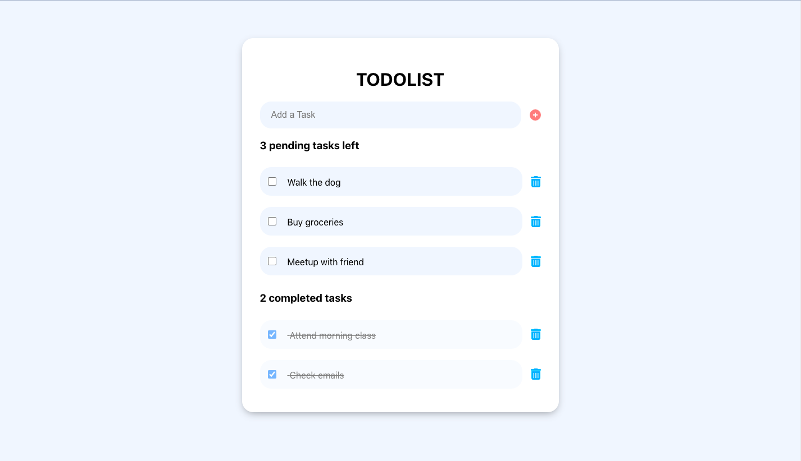

# TODO APP

## Aim

Creating a simple TODO app using TypeScript, Styled Components in React connected to local database mySql. Features include the ability to add and remove a new task. This project aimed to provide a better understanding of Typescript, styled-components for a client project.

## Screenshot

## Future Implementations

-   Additional features e.g. edit a task, dates and deadlines
